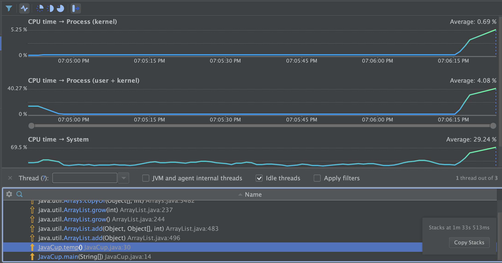
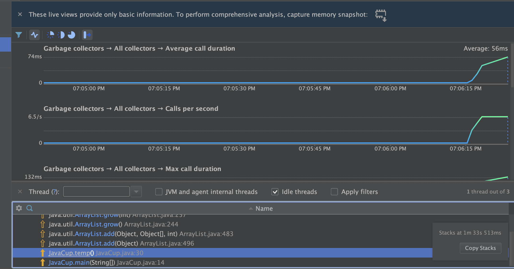

# آشنایی با نحوه پروفایل برنامه (Profiling)

لینک git: <https://github.com/Negarnbkhti42/SE-Lab-profiling>
## اعضای گروه
نگار نوبختی - 98171201

پریمهر مرصع‌فر - 98171148

## شرح آزمایش

1. در بخش اول، عملیات profiling را بر روی کلاس JavaCup انجام دادیم. نتیجه به شکل زیر بود که نشان می‌داد تابع `temp` بیشترین منابع cpu را مصرف می‌کند. مخصوصا آنکه توابع `add` و `grow` مربوط به `ArrayList` بارها باید فراخوانی ‌می‌شدند.

همچنین در حافظه نیز از garbage collector استفاده می‌شد.

برای رفع این مشکل در تابع `temp` به جای `ArrayList` از یک آرایه دوبعدی استفاده کردیم که اندازه آنها از قبل مشخص است. بدین صورت تغییر اندازه‌ای در ساختار داده رخ نمی‌دهد و مصرف منابع کم می‌شود. پس از pofiling همین نتیجه مشاهده شد. مصرف garbage collector نیز تقریبا به صفر رسید.

2. در بخش دوم، در کد اولیه یک فیبوناچی در عبارت unoptimized نوشتیم که به صورت بازگشتی ۴۰ عدد اول فیبوناچی را بدست می آورد. مصرف cpu و مموری و کاهش در تصاویر زیر قابل رویت است. 

برای optimized کردن آن به جای استقاده از recursive از dynamic programming استفاده می‌کنیم. به گونه ای که مقادیر قبلی را در  hashmap ذخیره می کنیم که به آن ها دسترسی وجود داشته باشد. مقادیر استفاده از منابع و کاهش در این حالت نیز به شرح زیر است. 

